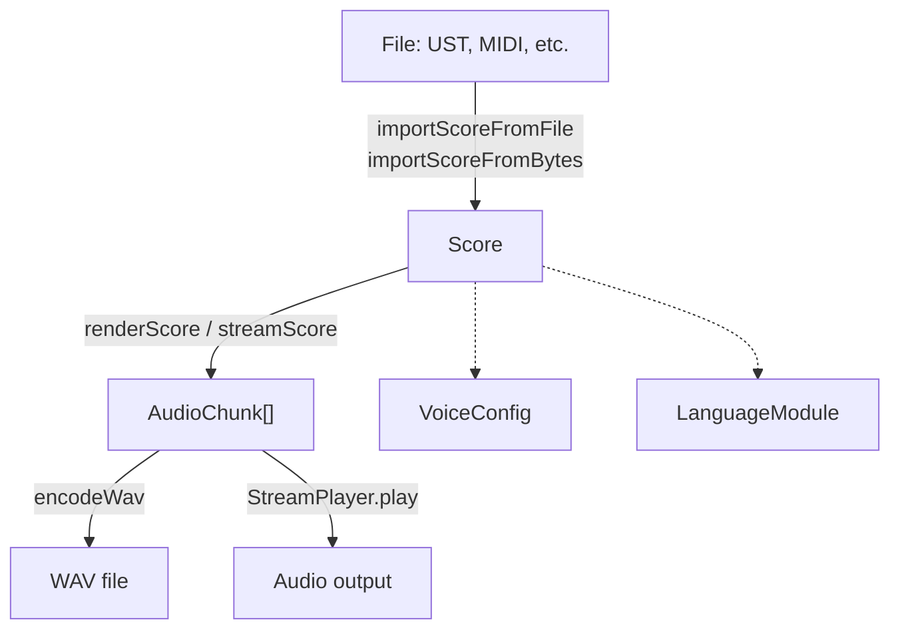

## Module Layout

The library is organised into four layers:

```text
src/
  core/              - Data types + low-level DSP primitives
    types.ts         - VoiceConfig, Note, Score, PhonemeDef, etc.
    dsp/             - LF glottal source, formant filters, noise, envelope, WAV
  langs/             - Language modules (G2P, phoneme inventories)
    index.ts         - Registry + lookup
    english.ts       - ARPAbet + CMUDict G2P
    japanese.ts      - Hiragana/romaji + EDICT2 kanji G2P
    mandarin.ts      - Pinyin syllable decomposition
    alias.ts         - Cross-language canonical phoneme mapping
  synth/             - Rendering pipeline
    renderer.ts      - Single-note renderer
    stream.ts        - Score-level streaming + mixing
  voices/            - Voice presets and configuration
    index.ts         - maleVoice, femaleVoice, buildVoice, scaleVoice
  player/            - Web Audio playback
    stream-player.ts - AsyncGenerator consumption + AudioContext scheduling
  import/            - File import (utaformatix-ts based)
    ufdata.ts        - ufDataToScore, importScoreFromFile, importScoreFromBytes
  export/            - File export (utaformatix-ts based)
    ufdata.ts        - scoreToUfData, exportScoreToBytes, exportScoreToBlob, downloadScore
```

## Data Flow



## Design Decisions

- **DSP is stateless per-note**: Each note render creates its own `LFGlottalSource` and `FormantCascade` instances. The only cross-note state is the last phoneme's formant targets, passed as `prevFormants` for smooth transitions.
- **Lazy G2P loading**: utaformatix-ts is loaded on first import/export call, keeping the initial bundle small.
- **No Web Audio dependency in the core**: The synth layer produces `AudioChunk` objects with no DOM or AudioContext dependency. Only `StreamPlayer` touches the Web Audio API.
- **Platform-agnostic types**: `AudioChunk` uses `Float32Array` arrays, compatible with both Node.js and browser environments.
