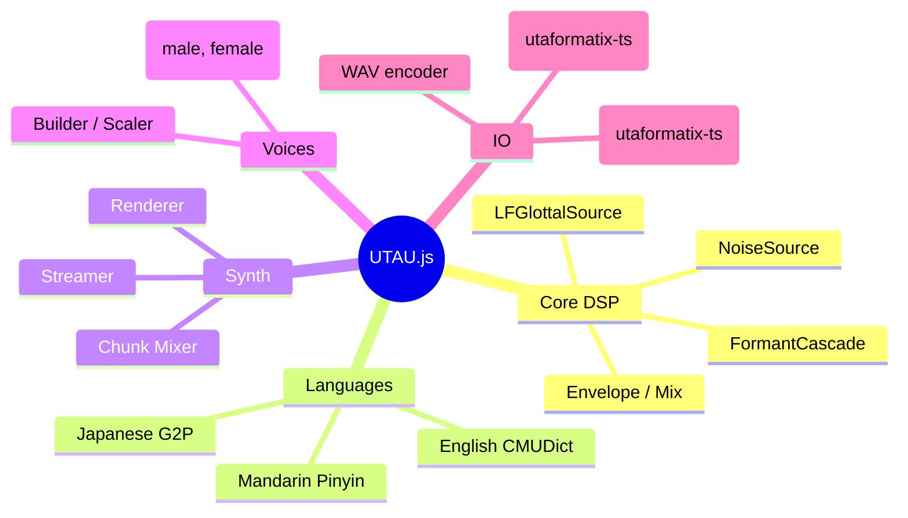

# UTAU.js

Parametric singing voice synthesis in the browser and Node.js. Implements a
source-filter model with an LF glottal source and cascaded formant filter.

Visit the [live demo](https://nellowtcs.me/UTAU.js)!

```bash
npm install utaujs
```

## Features

- **LF Glottal Source** - Liljencrants-Fant pulse model with independent
  control of OQ, SQ, tenseness, aspiration noise, jitter, and shimmer
- **Formant Cascade** - Series of resonators and anti-resonators modelling
  the vocal-tract transfer function, with smooth cross-phoneme interpolation
- **Three Languages** - English (ARPAbet + CMUDict G2P), Japanese (hiragana/
  romaji + kanji), Mandarin (pinyin decomposition). Extensible via
  `registerLanguage`
- **File Import / Export** - 16 import + 14 export formats from UTAU, VOCALOID,
  Synthesizer V, CeVIO, MusicXML, Standard MIDI, and more via utaformatix-ts
- **Streaming Playback** - AsyncGenerator-based render pipeline with Web Audio
  batch scheduling and buffer pooling
- **OneVoice System** - One parametric voice config tuned to perceptual
  dimensions. `scaleVoice()` maps high-level sliders (gender, breathiness,
  brightness, tension) to the underlying DSP parameters
- **Zero Native Dependencies** - Pure TypeScript, runs anywhere Node.js 18+
  or a modern browser runs

## Quickstart

```typescript
import { renderScore, femaleVoice, japanese, encodeWav } from "utaujs";
import { writeFileSync } from "node:fs";

const score = {
  tempos: [{ tick: 0, tempo: 120 }],
  resolution: 480,
  notes: [
    { lyric: "こ", noteNum: 60, length: 480 },
    { lyric: "ん", noteNum: 62, length: 480 },
    { lyric: "に", noteNum: 64, length: 480 },
    { lyric: "ち", noteNum: 65, length: 480 },
    { lyric: "は", noteNum: 67, length: 960 },
  ],
};

const chunks = await renderScore(score, femaleVoice, "jp");
const wav = encodeWav(chunks);
writeFileSync("hello.wav", Buffer.from(wav));
```

Stream to audio output in the browser:

```typescript
import { streamScore, femaleVoice, japanese, StreamPlayer } from "utaujs";

const player = new StreamPlayer();
await player.play(streamScore(score, femaleVoice, "jp"));
```

## API Overview

| Export                                                       | Description                                  |
|--------------------------------------------------------------|----------------------------------------------|
| `renderScore`                                                | Render full score to AudioChunk[]            |
| `streamScore`                                                | Render score as AsyncGenerator for streaming |
| `encodeWav`                                                  | Encode AudioChunk[] to WAV bytes             |
| `mixChunks`                                                  | Mix overlapping chunks into a single buffer  |
| `buildVoice` / `scaleVoice`                                  | Create and parameterize VoiceConfig presets  |
| `maleVoice` / `femaleVoice`                                  | Built-in voice presets                       |
| `japanese` / `english` / `mandarin`                          | Language modules with G2P                    |
| `importScoreFromFile` / `importScoreFromBytes`               | Import file formats                          |
| `exportScoreToBytes` / `exportScoreToBlob` / `downloadScore` | Export to any format                         |
| `scoreToUfData` / `ufDataToScore`                            | Low-level UtaFormatix data conversion        |
| `StreamPlayer`                                               | Web Audio playback with real-time scheduling |
| `registerLanguage` / `registerVoice`                         | Extend with custom languages or voices       |

Full API reference at [Docs/](Docs/) or [https://nellowtcs.me/UTAU.js/docs](https://nellowtcs.me/UTAU.js/docs).

## Architecture



## Development

```bash
# clone with submodules (required for CMUDict)
git clone https://github.com/NellowTCS/UTAU.js.git --recurse-submodules
cd UTAU.js/Build

npm install
npm run build     # builds G2P data + library
npm test          # 160+ tests via Jest
npm run typecheck # tsc --noEmit
npm run lint      # ESLint
```

The docs site lives in `Docs/` and uses DocMD. To preview:

```bash
cd Docs
npm install
npm run dev
```

## License

MIT - see [LICENSE](LICENSE).
