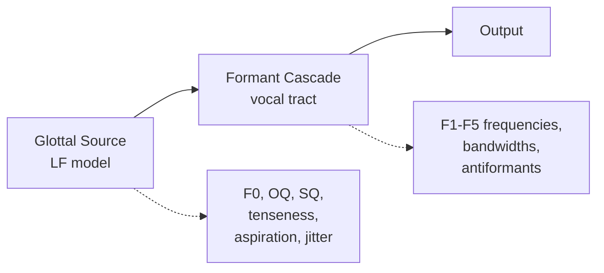

---
title: "Core Concepts"
description: "Understand how UTAU.js produces singing voice audio"
---

## Source-Filter Model

UTAU.js implements the **source-filter model of speech production**: a glottal source (the "buzz" from the vocal folds) is shaped by a filter (the vocal tract's resonances). This separation lets you control pitch and timbre independently.

The glottal source generates a periodic pulse train at the fundamental frequency (F0). The formant cascade applies a series of resonators (poles) and anti-resonators (zeros) to shape the spectrum into vowels and consonants.

## VoiceConfig

The `VoiceConfig` is the central configuration object. It bundles:

| Component    | Controls                                     | Perceptual Effect                             |
|--------------|----------------------------------------------|-----------------------------------------------|
| `glottal`    | OQ, SQ, tenseness, aspiration, power, jitter | Voice quality, breathiness, roughness         |
| `formant`    | Scale, shift, bandwidth                      | Vocal-tract size, brightness, resonance width |
| `vibrato`    | Rate, depth, attack                          | Pitch modulation (vibrato)                    |
| `sampleRate` | Output sample rate                           | Audio fidelity                                |
| `channels`   | Mono or stereo                               | Output format                                 |

See the [VoiceConfig reference](../api/voice-config.md) for detailed parameter documentation.

## Language Modules

Each language module provides:

- A **phoneme inventory** (Map of symbol -> acoustic definition)
- A **G2P converter** (lyric text -> phoneme symbol sequence)
- Optional **accent resolution** (pitch-accent patterns for prosody)

Built-in languages cover English (ARPAbet + CMUDict), Japanese (hiragana/romaji + EDICT2), and Mandarin (pinyin decomposition).

## Score and Rendering

A `Score` is a sequence of notes with a tempo map. The renderer:

1. Converts each note's lyric to phoneme symbols via the language module
2. Maps phoneme symbols to acoustic targets (formants, noise parameters)
3. Generates a glottal pulse train at the note's F0 (+ pitch bend + vibrato)
4. Filters through the formant cascade (with cross-phoneme interpolation)
5. Mixes in noise for consonants
6. Applies amplitude envelopes and normalisation

The output is an `AudioChunk` per note, carrying sample-accurate timeline positioning.

## Streaming

`streamScore()` returns an `AsyncGenerator<AudioChunk>`, producing one chunk at a time. This enables interleaved rendering and playback via `StreamPlayer`, which schedules chunks against the Web Audio clock with batching and buffer pooling.
